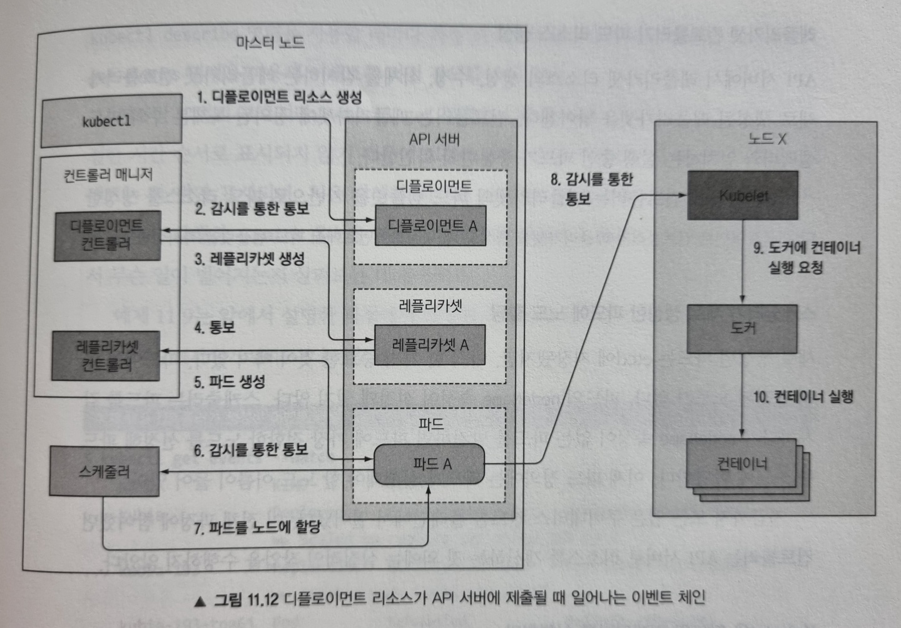

## 아키텍쳐 이해
### 쿠버네티스 클러스터
- Control Plane
  - 구성 요소
    - etcd 분산 저장 스토리지
      - 키/값 형태
      - 저장된 모든 리소스의 완전한 JSON 표현을 저장
      - RAFT 합의 알고리즘 사용으로 대다수의 노드가 동의하는 현재 상태만을 저장하여 일관성을 유지
      - 합의 알고리즘에 의해 과반을 유지해야 하기 때문에, 홀수로 구성
    - API 서버
      - 모든 요청은 API 서버 한 곳에서 처리
      - 낙관적 잠금 메커니즘을 갖고 있어 오류를 줄이고, 항상 일관성을 유지
      - 잘못 설정된 오브젝트를 저장할 수 없도록 처리
      - 리소스 생성 과정
        - 클라이언트(kubectl) -> HTTP POST 요청 -> 인증 플러그인 -> 인가 플러그인 -> 어드미션 컨트롤 플러그인 -> 리소스 유효성 검사 -> etcd
        - 클라이언트 인증 또는 HTTP 헤더를 통해 **인증**
        - 인증된 사용자가 요청한 작업이 요청한 리소스를 대상으로 수행할 수 있는지를 **인가**
        - 데이터를 읽는 경우를 제외한 모든 경우가 어드미션 컨트롤 플러그인을 통함
      - 구성 요소가 배포된 리소스의 변경 사항을 관찰
    - 스케줄러
      - 기본 스케줄링 알고리즘
        - 모든 노드 중 파드를 스케줄링할 수 있는 노드 목록을 필터링
        - 우선순위를 정하고 가장 점수가 높은 노드를 선택
      - 미리 설정된 조건 함수 목록에 각 노드를 전달하여 수용 가능한 노드를 찾음
        - 하드웨어 리소스에 대한 파드 요청을 충족시키는가?
        - 노드의 테인트나 톨러레이션을 허용하는가?
        - 파드가 노드에 어피니티, 안티 어피니티 규칙을 지정했는가?
        - ... 등
    - 컨트롤러 매니저
      - API 서버로 배포된 리소스에 지정된 대로 시스템을 구성
      - 디플로이먼트 컨트롤러, 스테이트풀셋 컨트롤러, 노드 컨트롤러, 서비스 컨트롤러 등 거의 모든 리소스에 대해 컨트롤러가 존재
      - 조정 루프를 실행해 실제 상태를 원하는 상태로 조정
  - `kubectl get componentstatuses` 명령어로 각 구성 요소의 상태를 조회
  - 모든 구성 요소는 마스터 노드에서 실행
- Worker Node
  - Kubelet
    - 워커 노드에서 실행하는 모든 것을 담당하는 구성 요소
    - 실행 중인 노드를 노드 리소스로 만들어서 API 서버에 등록
    - API 서버를 지속적으로 모니터링해 해당 노드에 파드가 스케줄링되면, 파드 컨테이너 시작
    - 설정된 컨테이너 런타임으로 컨테이너를 실행하도록 지시
    - 실행중인 컨테이너를 계속 모니터링하면서 상태, 이벤트, 리소스 사용량을 API 서버에 보고
  - 쿠버네티스 서비스 프록시 (kube-proxy)
    - 클라이언트가 API로 정의한 서비스에 연결할 수 있도록 해주도록 Proxy를 실행
    - DaemonSet 형태로 배포되어 있음
    - 워커 노드에 배포된 Pod들 간의 통신을 가능하게 함
    - 서비스가 생성되면, 서비스의 IP/포트 쌍으로 향하는 패킷을 가로채고 목적지 주소를 변경해서 패킷이 서비스를 지원하는 여러 파드 중 하나로 리디렉션되도록 하는 몇 개의 iptables 규칙을 설정
    - 서비스에 할당되는 IP/포트는 가상이라 핑을 보낼 수 없음
  - 컨테이너 런타임
- 애드온 구성 요소
  - 종류
    - 쿠버네티스 DNS 서버
    - 대시보드
    - 인그레스 컨트롤러
    - 힙스터
    - 컨테이너 네트워크 인터페이스
  - 클러스터 상태를 관찰하고 변화가 생기면 그에 맞는 필요한 조치를 수행
- 쿠버네티스 시스템 구성 요소는 오직 API 서버하고만 통신
- Deployment 리소스가 생성되는 과정
  - 
- 파드가 실행되면 Docker에 `pause` 이름으로 컨테이너가 실행되는데, 이 컨테이너는 모든 컨테이너를 함께 담고 있음
  - 인프라스트럭처 컨테이너라고도 함
  - 한 파드의 모든 컨테이너가 동일한 네트워크와 리눅스 네임스페이스를 공유할 수 있도록 해주는 컨테이너
- 파드간 네트워크 통신이 NAT 없이 플랫 네트워크로 통신하기 위해 컨테이너 네트워크 인터페이스(CNI) 플러그인을 제공
- 동일 노드 내의 파드 간 통신
  - Pod의 컨테이너를 위한 veth가 생성
  - 컨테이너 런타임이 사용할 수 있도록 설정된 네트워크 브릿지에 연결
  - 파드 A에서 파드 B로 패킷을 보내는 경우
    - 파드 A -> 파드 A의 veth -> 브릿지 -> 파드 B의 veth -> 파드 B
- 서로 다른 노드 간 파드 통신
  - 오버레이, 언더레이 네트워크 혹은 Layer 3 라우팅을 통해 가능
  - Layer 3 라우팅
    - 노드의 물리 네트워크 인터페이스도 브릿지에 연결
- 고가용성 클러스터 구성
  - etcd
    - 분산 시스템으로 설계되어서 가용성을 높이는 건 어렵지 않음
    - 각 etcd 인스턴스가 서로 접근할 수 있도록 IP와 포트를 지정해주면 됨
  - API 서버
    - 상태를 저장하지 않는 stateless 구조이기 때문에 필요한 만큼 API 서버를 실행하면 됨
  - 컨트롤러와 스케줄러
    - 한 번에 하나의 인스턴스만 활성화하고 나머지는 대기 상태로 두도록 함
    - 자등으로 `--leader-elect` 옵션에 의해 리더만 작업을 수행하고 나머지 인스턴스는 대기하면서 리더가 실패하기를 기다림