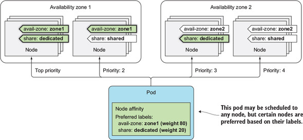

# 고급 스케줄링
## Taint와 Toleration
- 어떤 파드가 특정 노드를 사용할 수 있는지를 제한
- 노드의 Taint와 파드의 Toleration이 일치하면 파드가 해당 노드에 스케줄링될 수 있음
- Taint
  - key=value:effect 형태로 표시
  - 키 값
    - NoSchedule: 파드가 테인트를 허용하지 않는 경우 파드가 노드에 스케줄링되지 않음
    - PreferNoSchedule: NoSchedule하려고 하지만, 다른 곳에 스케줄링할 수 없으면 해당 노드에 스케줄링
    - NoExecute: 해당 노드에 **이미 실행 중**이지만, NoExecute 테인트를 허용하지 않는 파드는 노드에서 제거
- 하나의 클러스터에 Production과 dev 워크로드가 있을 경우에 파드 스케줄링
  ```bash
  kubectl taint node nodeA node-type=production:NoSchedule # nodeA에 taint를 설정
  kubectl apply -f deployment-no-toleration.yaml # toleration이 없는 pod 실행
  ```
  - 위의 명령어 실행 시 test라는 pod는 nodeA를 제외한 나머지 노드 중 하나에 스케줄링
- 해당 노드 taint와 일치하는 toleration을 가진 파드를 생성했을 때 모든 노드에 스케줄링이 될 수 있음
  - ex. A 노드에 NoSchedule taint와 일치하는 toleration을 가진 파드를 생성해도 B 노드, C 노드에 스케줄링이 됨
- 기본적으로 파드를 생성하면 `not-ready`, `unreachable` toleration을 가지고 있고 해당 상태를 300초 동안 허용함
  - 노드가 더 이상 준비되지 않았거나(not-ready), 더 이상 도달할 수 없다는 것(unreachable)을 감지하면 파드를 삭제하고 다른 노드로 다시 스케줄링하기 까지 300초를 대기

## Node Affinity
- 특정 노드 집합에만 파드를 스케줄링하도록 지시
- 배포 조건
  - `requiredDuringScheduling...`: 파드가 노드로 스케줄링되고자 가져야 하는 레이블을 지정
  - `IgnoredDuringExecution`: 노드에서 이미 실행 중인 파드에는 영향을 미치지 않음
  - `preferredDuringScheduling`: 상황에 따라 조건에 맞지 않는 노드에 배포할 수도 있음
    - weight 값을 사용해 파드가 배치될 노드에 우선순위(=비중)을 설정할 수 있음
    - 우선순위를 결정하는 방법
      
    - `Selector-SpreadPriority` 기능에 의해 최상위 우선순위를 가진 노드에 파드 비중의 100%를 배포하지 않고 자동으로 하위 우선순위를 가진 노드에도 배포
      - 노드 장애로 인한 서비스 중단을 방지하기 위해 -> 고가용성
  - `RequiredDuringExecution`: 미지원

## Pod Affinity와 Pod AntiAffinity
- 파드를 서로 가깝게 배치할 수 있음
- pod affinity로 연결된 두 파드 Set 중 pod affinity가 정의되지 않은 파드를 삭제해도 기존의 노드로 스케줄링
  - ex. pod affinity가 설정된 프론트엔드 파드와 백엔드 파드가 있는 상황에서 백엔드 파드를 지워도 기존에 있던 노드로 다시 스케줄링하여 생성
- pod antiaffinity도 affinity 설정과 마찬가지로 동일한 방식으로 지정
  - 두 개의 파드 세트가 동일한 노드에서 실행되는 경우 서로의 성능을 방해할 때 이 기능을 사용
  - 동일한 그룹의 파드를 다른 가용 영역 또는 리전에 분산시켜 가용성을 확보할 때 사용
- 