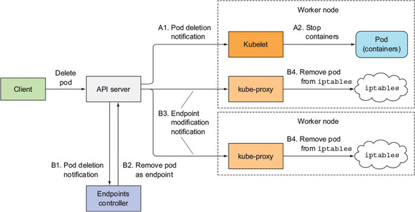

# 애플리케이션 개발을 위한 모범 사례
- 일반적인 애플리케이션 쿠버네티스 구성 요소
  

## 파드의 라이프사이클
- 파드는 언제든지 종료될 수 있음을 잊으면 안 됨
- 애플리케이션 간 통신을 IP 주소 기반으로 하면 안 되고 호스트 이름으로 기반해야 함
- 컨테이너 내의 데이터를 보존하기 위해서는 컨테이너 내의 파일시스템에 데이터를 보존하기 보다 적어도 파드 범위의 볼륨을 사용
- 파드의 컨테이너가 계속 Crash되면 Kubelet은 파드를 계속 재시작
  - 재시작 간격은 5분이 될 때까지 증가하며 지수 백-오프(10초, 20초, 40초 ...)로 증가
  - 컨테이너가 성공적으로 시작된 후 10분이 지나면 지연 시간은 초기화
- replicaset은 파드의 상태가 `CrashLoopBackOff`일 때 이것을 실제 실행 중인 파드로 간주
  - 실제로 replicaset의 pod 상태를 확인해보면 `Running` 상태로 확인
- 초기화 컨테이너
  - `spec.initContainers` 로 정의
  - 파드의 주 컨테이너 시작을 지연시킬 수 있음
  - 파드는 여러 개의 초기화 컨테이너를 가질 수 있음
  - 초기화 컨테이너가 먼저 실행되고 나서 나머지 컨테이너가 실행
  - 초기화 컨테이너를 필요로 하게 애플리케이션을 만들어 의존도를 높이면 좋지 않음
  - 대체로 `readiness probe`를 사용하여 의존성 처리를 함
- 라이크사이클 훅
  - 컨테이너 별로 설정할 수 있음
  - post-start hook
    - 컨테이너의 주 프로세스가 시작된 직후에 실행
    - 애플리케이션이 시작될 때 추가 작업을 수행하는 사용
    - post-start 훅이 완료될 때까지 컨테이너는 `ContainterCreating`인 채로 `Waiting`상태가 유지
    - post-start 훅이 훅이 실행되지 않거나 0이 아닌 종료 코드를 반환하면 주 컨테이너가 종료
    - post-start 훅이 훅에서 실행한 표준 출력 기록은 확인할 수 없으므로 컨테이너의 파일 시스템에 기록을 해야 함
  - pre-stop hook
    - 컨테이너가 종료되기 전에 실행
    - kubelet이 pre-stop 훅을 실행한 다음 SIGTERM을 전송
    - post-start 훅과는 다르게 훅이 실패해도 파드가 종료되기 때문에 실제로 훅이 제대로 작동했는지 알 수 없음
  - 수행할 수 있는 동작
    - 컨테이너 내부에서 명령 실행
    - URL로 HTTP GET 요청 수행
  - 라이크사이클 훅은 파드가 대상이 아닌 컨테이너와 관련이 있음

## 파드 셧다운
- 종료 순서
  - API 서버로 파드 오브젝트를 삭제 요청 -> 바로 삭제하지 않고 `deleteTimestamp` 필드만 설정 -> 해당 필드가 설정된 파드를 종료
- 각 컨테이너는 종료하는데 시간이 걸리고 이 시간을 종료 유예 기간(termination grace period) 이라고 하고 파드별로 구성이 가능
- 컨테이너 종료 순서
  - pre-stop 훅(구성된 경우)을 실행하고 완료할 때까지 대기
  - SIGTERM 신호를 컨테이너의 주 프로세스에 보냄
  - 컨테이너가 완전히 종료될 때까지 혹은 종료 유예 기간이 끝날 때까지 대기
  - 정상적으로 종료되지 않은 컨테이너는 SIGKILL로 강제 종료
- 종료 유예 기간은 `terminateGracePeriodSeconds` 필드로 설정할 수 있고, 기본 값은 30초
- `kubectl delete` 명령에서 `--grace-period` 값으로 종료 유예 기간을 재정의할 수 있음
- `--force` 옵션으로 statefulset pod를 강제 삭제할 때는 주의
  - 파드를 강제 삭제하면 삭제된 파드의 컨테이너가 종료될 때까지 기다리지 않고 컨트롤러에서 교체 파드를 바로 생성하기 때문 (서수 인덱스의 이름이 같은 파드가 있으면 안 됨)
- 애플리케이션이 분산 데이터 저장소라면, 크론잡 리소스를 통해 데이터 마이그레이션 파드를 이용해 종료 전 파드의 데이터를 마이그레이셩 해야 함

## 모든 클라이언트 요청의 적절한 처리 보장
- readiness probe를 설정
  - 없는 경우 파드가 생성되자마자 서비스와 연결된 파드는 바로 트래픽을 수신하기 때문에 애플리케이션이 완벽히 실행되지 않았을 때도 트래픽이 들어오기 때문
- 파드를 삭제할 때 발생하는 이벤트 순서
  - 
- 파드는 종료 신호를 보낸 후에도 클라이언트 요청을 받을 수 있음
- 컨테이너와 파드를 즉시 종료하지 않고 지연 시간을 추가해 요청이 완전히 종료하는 것을 최대한 보장
  - `lifecycle.preStop.exec.command` 에 `sleep` 명령어를 설정

## 애플리케이션을 더 쉽게 실행하고 관리
- 새로운 파드의 배포를 빠르게 하기 위해선 컨테이너 레지스트리는 크기를 최소화하여 유지하는게 좋음
- 컨테이너 이미지 버전에서 `latest` 사용을 지양하고, 만약 사용했다면 `imagePullPolicy: always`로 설정하여 새 파드가 배포될 때 마다 이미지를 항상 다운로드하게 설정
- 일차원 레이블보단 다차원 레이블 설정으로 리소스의 구분을 확실하게 하는게 좋음
- 리소스 정보 추가를 위해서는 어노테이션을 사용
- `spec.containers.terminationMessagePath`로 파드가 종료될 때 메세지를 설정할 수 있음
- 중앙 집중식 로깅 시스템을 구축
  - ELK(`ElasticSearch`, `Logstash`, `Kibana`), EFK(`ElasticSearch`, `FluentD`, `Kibana`) 스택
  - FluentD를 각 노드에 데몬셋 형태로 배포하여 로그를 수집하고 ElasticSearch에 저장하며 Kibana로 시각화