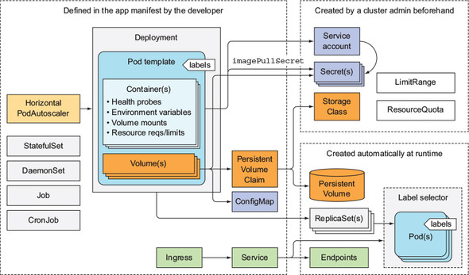

# 애플리케이션 개발을 위한 모범 사례
- 일반적인 애플리케이션 쿠버네티스 구성 요소
  

## 파드의 라이프사이클
- 파드는 언제든지 종료될 수 있음을 잊으면 안 됨
- 애플리케이션 간 통신을 IP 주소 기반으로 하면 안 되고 호스트 이름으로 기반해야 함
- 컨테이너 내의 데이터를 보존하기 위해서는 컨테이너 내의 파일시스템에 데이터를 보존하기 보다 적어도 파드 범위의 볼륨을 사용
- 파드의 컨테이너가 계속 Crash되면 Kubelet은 파드를 계속 재시작
  - 재시작 간격은 5분이 될 때까지 증가하며 지수 백-오프(10초, 20초, 40초 ...)로 증가
  - 컨테이너가 성공적으로 시작된 후 10분이 지나면 지연 시간은 초기화
- replicaset은 파드의 상태가 `CrashLoopBackOff`일 때 이것을 실제 실행 중인 파드로 간주
  - 실제로 replicaset의 pod 상태를 확인해보면 `Running` 상태로 확인
- 초기화 컨테이너
  - `spec.initContainers` 로 정의
  - 파드의 주 컨테이너 시작을 지연시킬 수 있음
  - 파드는 여러 개의 초기화 컨테이너를 가질 수 있음
